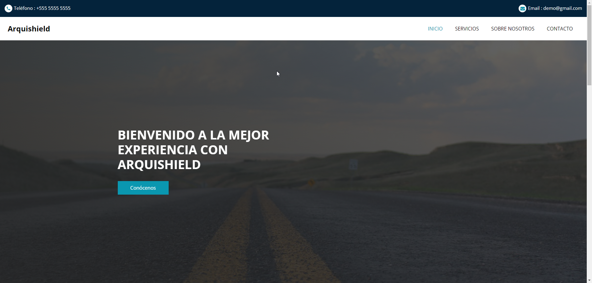
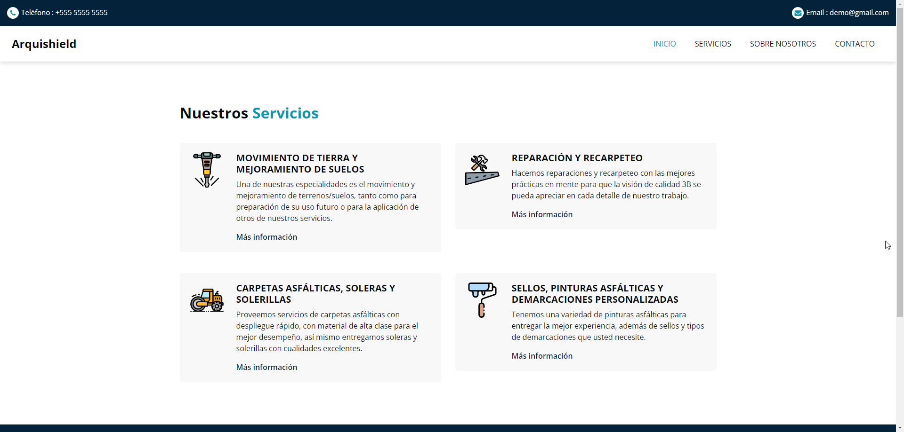

# django-asfaltos3B

Éste proyecto fue hecho a pedido de un cliente para su empresa.

## Instalación
    
Ejecuta estos comandos en terminal

* `venv\Scripts\activate`

* `python manage.py runserver`

[Abrir la página](http://127.0.0.1:8000/)

## Tecnologías
* Python
* Django
* Bootstrap
* JavaScript
* SCSS    
  
## Screenshots : 

